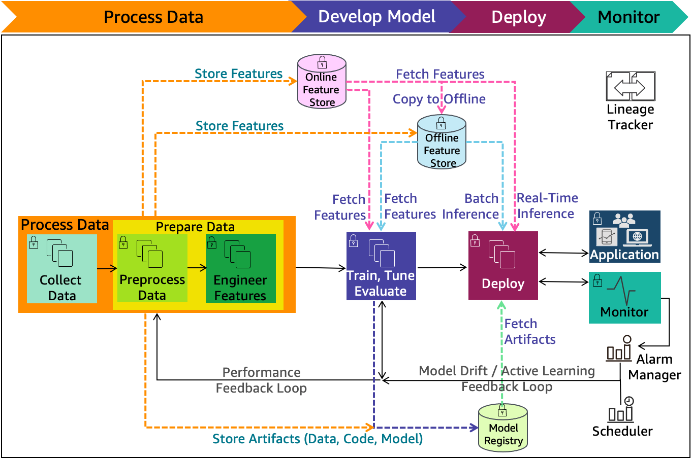

# Context & Architecture

Additionally, include data flow diagrams.

 

## System Context Diagram

The system context diagram illustrates how the service node of the system interacts with the world it is serving; a 
[slightly complex example](https://docs.conda.io/projects/conda/en/4.14.x/architecture.html#level-1-context).

 

## Architecture

The architecture, which outlines integrations with other systems, modelling stages, data flows, monitoring node, 
re-training node, etc.

 
 

 
 

<figure>
<figcaption>A platform agnostic example courtesy of <a href="https://docs.aws.amazon.com/wellarchitected/latest/machine-learning-lens/ml-lifecycle-architecture-diagram.html" target="_blank">Amazon Web Services</a>; scroll down.
</figcaption>
</figure>

 
 

 
 

 
 

 
 
