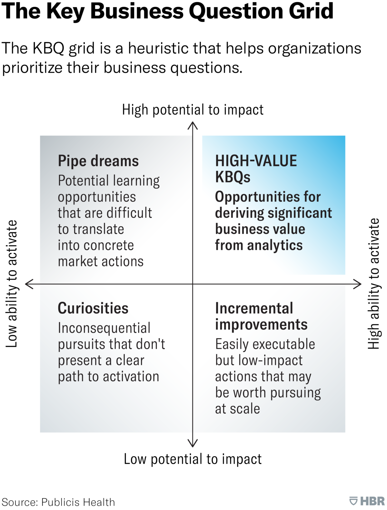

# Project Plausibility

A solid basis is key.

## A Team's Key Business Questions

In a 2018 article, Kevin Tyranos proposed a few steps that may aid a team's generation of its Key Business Questions form its Business Outcomes Targets.[^Tyranos2018]  In brief, and minimally adapted,

<ol class="numeric">
  <li class="numeric">Business Outcomes<ul><li>Reduce operational cost due to intensive care unit hypoglycaemic incident care costs.</li><li>Reduce risk costs due to intensive care unit hypoglycaemic incident mortality rates.</li></ul>
  </li>
  <li class="numeric">An in-depth evaluation of knowledge & data understandings till date.</li>
  <li class="numeric">Outline key business questions, e.g.,
    <ul><li>Is it possible to continuously predict the probability of a hypoglycaemic incident amongst our intensive care unit patients?</li>
    <li>Is it possible to automatically warn intensive care unit colleagues if a patient is at risk of a hypoglycaemic incident within the next 6 hours?</li></ul>
  </li>
  <li class="numeric">Prioritise</li>
</ol>

<br>
<br>

<!--suppress CheckImageSize -->


<figure>
  <figcaption><br></br>Source: <a href="https://hbr.org/2020/02/use-data-to-answer-your-key-business-questions" target="_blank"><u>Publicis Health, via Harvard Business Review</u></a>
  </figcaption>
</figure>

<br>
<br>

The <b>pipe dreams</b> cell also addresses the question - do the capabilities to achieve an objective exist?

> _If you don’t have the right CRM and tech infrastructure in place, you’ll be unable to put your model into play in the market, and your original question will end up as a pipe dream — its potential business impact is high, but your ability to realize this potential is effectively nonexistent._ [^Tyranos2020]


Therefore, ``... cross-functional teams capable of translating insight into action'' are critical.

<br>
<br>


## Prioritisation: The Quantitative Layer

Douglas A Gray's[^Gray2024a] quantitative prioritisation method is a systematic and unambiguous method.  It depends on

<table style="width: 85%; margin-left: 65px; vertical-align: top; font-size: small;">
    <colgroup>
        <col span="1" style="width: 26.5%;">
        <col span="1" style="width: 63.5%;">
    </colgroup>
    <thead><tr style="text-align: left"><th>&nbsp;</th><th>Notes & Scoring</th></tr></thead>
        <tr><td><br>Business Value Potential</td><td><br>More details further below; including a scoring enhancement step.<br><br>Business Value Potential Scoring: highest business value potential <b>10</b>, lowest business value potential <b>1</b></td></tr>
        <tr><td><br>Complexity</td><td><br><i>Complexity, in effect, is an important surrogate measure for risk; i.e., the more complex a project is, the more likely it is that you will run into difficulties that end up manifesting themselves in timeline delays and budget overruns and jeopardize the whole project</i> [From <a href="https://www.taylorfrancis.com/books/mono/10.1201/9781032661360/data-science-projects-fail-evan-shellshear-douglas-gray" target="_blank"><u>Why Data Science Projects Fail</u></a>]<br><br>Complexity Scoring: lowest complexity <b>10</b>, highest complexity <b>1</b></td></tr>
        <tr><td><br>Project Cost</td><td><br>Labour Cost, Materials & Computing Cost.<br><br>Project Cost Scoring: lowest cost <b>10</b>, highest cost <b>1</b>.  A scoring enhancement step is outlined below.</td></tr>
</table>

<br>
<br>

Hence, the <b>priority score</b> is

> _business value potential score_ $\times$ _complexity score_ $\times$ _project cost score_

The highest possible score is $1000$.  Amongst a set of projects, a project that manages to achieve a $1000$ score <b>(a)</b> has the highest business value, <b>(b)</b> is the least complex, and <b>(c)</b> is the least costly -- **potentially & relatively**.


<br>


### Business Value Potential

Organisations use a few metrics, e.g.,

<ul class="disc">
  <li class="disc"><a href="https://blackswanfarming.com/cost-of-delay/" target="_blank">Cost of Delay</a>: Supplementary Material &rarr; <a href="https://blackswanfarming.com/cost-of-delay-divided-by-duration/" target="_blank">Cost of Delay Divided by Duration</a>, <a href="https://blackswanfarming.com/four-steps-to-quantifying-cost-of-delay/"  target="_blank">Four steps to Quantifying Cost of Delay</a><br><br>
    <i>Cost of Delay is a way of communicating the impact of time on the outcomes we hope to achieve. More formally, it is the partial derivative of the total expected value with respect to time.</i> it <i>... combines urgency and value – two things that humans are not very good at distinguishing between.</i> [From <a href="https://blackswanfarming.com/cost-of-delay/" target="_blank">Cost of Delay</a>]    
  </li>
</ul>

<br>

<ul class="disc">
  <li class="disc">Marginal Benefit & Marginal Cost: For a given time period, does the marginal benefit exceed the marginal cost?</li>
</ul>  

> &nbsp; &nbsp; [^Marginal2018]<sup>,</sup> [^Marginal2024]

<ul class="disc">
  <li class="disc"><a href="https://www.investopedia.com/terms/n/npv.asp" target="_blank">Net Present Value (NPV)</a>; study <a href="https://www.investopedia.com/ask/answers/05/npv-irr.asp" target="_blank">NPV & IRR (Internal Rate of Return)</a>.</li>
</ul>

<br>

<ul class="disc">
  <li class="disc"><a href="https://www.investopedia.com/terms/r/returnoninvestment.asp"  target="_blank">Return on Investment (ROI)</a>; study <a href="https://accountinginsights.org/npv-vs-roi-key-differences-and-how-to-use-them-in-decision-making/">NPV & ROI</a>.</li>
</ul>

<br>

To avoid over/under penalising -- lowest $1$, highest $10$ -- scoring via a sigmoid function is an option.  Let $x$ represent a project's monetary business value potential, during a declared time period.  Sigmoid function dependent options include

$$tanh(x) = \frac{e^{x} - e^{-x}}{e^{x} + e^{-x}}$$
$$score = 10 \times tanh(x)$$

and

$$f(x) = \frac{x}{\bigl( 1 + x^{2} \bigr)^{0.5}}$$
$$score = 10 \times f(x)$$

<br>
<br>

### Project Cost

To avoid over/under penalising -- lowest $10$, highest $1$ -- scoring via a sigmoid function is also an option.  Let $x$ represent a project's monetary cost.  Sigmoid function dependent options include

$$tanh(x) = \frac{e^{x} - e^{-x}}{e^{x} + e^{-x}}$$
$$score = 10 \times \frac{1}{tanh(x)}$$

and

$$f(x) = \frac{x}{\bigl( 1 + x^{2} \bigr)^{0.5}}$$
$$score = 10 \times \frac{1}{f(x)}$$

<br>
<br>

## Viability/Feasibility Filters

```{mermaid}
%%{ init: { 'flowchart': { 'curve': 'monotoneX'} } }%%
flowchart LR    
    id0([start]) --> id1{<span title="Does the potential project have a budget?">budget</span>} 
    id1 -- yes --> id2{<span title="Is the budget, project timebox, and the collaboration commitment plausible?">budget,<br>time</span>}
    id1 -- no --> id3([terminate])
    id2 -- no --> id3
    id2 -- yes --> id5(<span title="The project scope/design details">project<br>details</span>)
    id5 --> id6{<span title="Is the potential project addressable via machine learning, technically feasible, and economically viable?">feasible?</span>}
    id6 -- no --> id3
    id6 -- yes --> id8(next <br> steps)
    
    classDef default fill:#333333,stroke:#333333,stroke-width:0px,color:#ffffff,font-size:11pt;
```

<br>

<figcaption>An illustration of considerations vis-à-vis a potential machine learning dependent project.  The project details inform the feasibility assessment.</figcaption>

<br>
<br>
<br>
<br>

<br>
<br>
<br>
<br>

[^Tyranos2018]: [How to Make Sure You’re Not Using Data Just to Justify Decisions You’ve Already Made](https://hbr.org/2018/10/how-to-make-sure-youre-not-using-data-just-to-justify-decisions-youve-already-made)

[^Tyranos2020]: [Use Data to Answer Your Key Business Questions](https://hbr.org/2020/02/use-data-to-answer-your-key-business-questions)

[^Gray2024a]: Chapter 2 of [Why Data Science Projects Fail: the Harsh Realities of Implementing AI and Analytics, without the Hype](https://www.taylorfrancis.com/books/mono/10.1201/9781032661360/data-science-projects-fail-evan-shellshear-douglas-gray)

[^Marginal2024]: [Marginal Benefit & Marginal Cost](https://www.investopedia.com/ask/answers/051815/what-difference-between-marginal-benefit-and-marginal-cost.asp)

[^Marginal2018]: [What is the Marginal Cost of Capital?](https://pressbooks.pub/businessfinanceessentials/chapter/chapter-10-marginal-cost-of-capital-2/)
