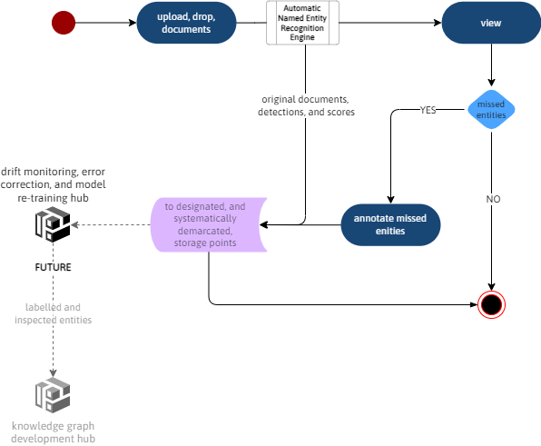

 

# Critical Preliminaries

## About

### Problem Statement

What is the problem, and why is it important to solve this problem?

 

### Outcome Expectations

What are the potential product's outcome expectations, e.g.,

<blockquote>
    An increase in the detection of early-stage, i.e. mild, diabetic retinopathy, hence the prevention of sight loss amongst a greater percentage of diabetic patients.
</blockquote>

 

The underlying aim might be, e.g.,

<blockquote>
    To reduce the mis-classification rate of retinal images of diabetic patients to ≤ 1.25% per class per quarter.
</blockquote>

 

### Deployment Goal

**What is the aim, expected output, of the product's model?**  Example:

<blockquote>
    A retinal image's diabetic retinopathy classification probability per class.
</blockquote>

 

**What will the deployed product present to the optician?**  **Or** rather, **how will the model's output be used?**  Considering the example above, the client's opticians might expect: [^deployment]

<ul class="disc">
    <li class="disc">The classification probability per class.</li>
    <li class="disc">The definition of each class.</li>
    <li class="disc">The classification; vis-à-vis the highest classification probability.</li>
    <li class="disc">The preliminary treatment pathway of the classification, according to the rules of the optician's institution.</li>
    <li class="disc">The retinal image.</li>
</ul>

 
 

## Example

### PROBLEM STATEMENT

An organisation manually classifies trauma incidents for all the major trauma centres of five countries.  Per trauma case, an injury coding expert <b>(a)</b> examines the case's free and structured text, and assigns each piece of text to a category, and <b>(b)</b> assigns the case to a trauma category based on the combination text pieces & categories detected; text pieces of the other/miscellaneous category are excluded from this exercise.  Trauma injury coding is an extremely intensive and time-consuming exercise, and injury coding error rates - per annum - can be quite high.  Hence, and as a first step, we are in search of a solution that automatically classifies text pieces vis-à-vis a set of provided categories.

 

### OUTCOME EXPECTATIONS, UNDERLYING AIMS

* <b>Outcome Expectations:</b> Real-time availability of classifications per trauma case.
* <b>Underlying Aim:</b> The automatic classification of trauma case text pieces; objective &#8594;
  * per case, automatic classification time < 180 seconds.
  * model metrics limits false negative rate &#8804; 0.02, false positive rate &#8804; 0.04

 

### DEPLOYMENT GOAL

A potential machine learning dependent project without a deployment goal is directionless, do not proceed.  A plausible deployment goal is 

<!--suppress CheckImageSize -->

 
 

 
 

 
 

 
 

[^deployment]: This is not machine learning.  This is about integrating a machine learning model's output into a business product, and hence business operations.

 
 
